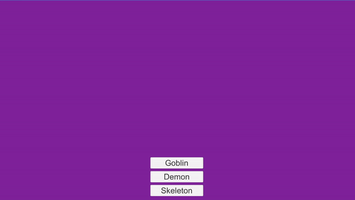

# PrototypePattern
Study Repository about the Design Pattern "Prototype"
Based on the book Game Programming Patterns by Robert Nystrom available at:
http://gameprogrammingpatterns.com/

## Setup
This was developed with Unity 2019.3.6f1

This is a Unity project, open it with the correct Unity version and you'll be able to run it.

## Art Sources

Monster Sprites: https://assetstore.unity.com/packages/2d/characters/monsters-creatures-fantasy-167949

## Output:

